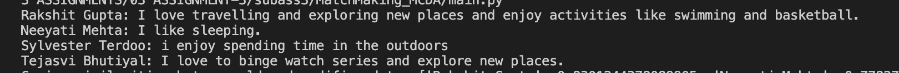
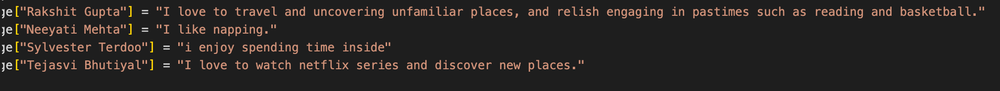
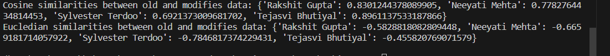

# MatchMaking_MCDA
Matching the people with similar interest with each other from MCDA class.

# What are Embeddings?

Word and sentence embeddings are a way to represent words and sentences in a computer-friendly format. They are used to capture the meaning of words and sentences so that computers can understand them better. Think of it like this: when we read a book, we understand the meaning of each word and how they relate to each other.This process of turning words and sentences into special codes or scores absed on their meaning is what we call embeddings. Therefore, word embeddings assign a score to each word based on how it relates to other words. For example, if we take the sentence “I like sleeping” and “I am too tired”, the word “sleeping” is related to “like” and “tired” is related to “am”. Word embeddings capture these relationships and assign scores to each word based on how they relate to other words. Sentence embeddings work in a similar way, but they assign scores to entire sentences instead of individual words. They are a powerful tool for making computers better at understanding human language. Here is an example of how word embeddings can be used: if we take the sentence “I like sleeping” and “I am too tired”, we can assign scores to each word based on how they relate to other words. The word “like” might have a score of 0.8 for “sleeping” and 0.2 for “tired”, while the word “am” might have a score of 0.8 for “tired” and 0.2 for “sleeping”. These scores can be used to determine the meaning of new sentences and how they relate to existing sentences.

# Data Analysis

We modified the sentences of four classmates by making both major and minor changes. For instance, in Rakshit Gupta's original sentence expressing love for travel and exploration, We altered the wording to emphasize a passion for uncovering unfamiliar places and engaging in activities like reading and basketball. Similarly, Neeyati Mehta's original sentence about liking sleeping remained unchanged, while Sylvester Terdoo's outdoor enjoyment became "spending time inside," and Tejasvi Bhutiyal's love for binge-watching series and exploring new places remained intact.

Actual Description

Modified Description

Similarity Scores

The comparison results between the old and modified data embeddings show interesting patterns. Using cosine similarity, Rakshit Gupta's and Tejasvi Bhutiyal's embeddings demonstrated high similarity (0.83 and 0.90, respectively), suggesting that the changes had a relatively small impact. Neeyati Mehta's embedding showed moderate similarity (0.78), while Sylvester Terdoo's had the lowest similarity (0.69), indicating a more noticeable impact.

Euclidean similarity measurements mirrored these trends, with Rakshit Gupta's and Tejasvi Bhutiyal's embeddings having lower negative values, signifying less impact. Conversely, Neeyati Mehta's and Sylvester Terdoo's embeddings had higher negative values, indicating more significant changes.
