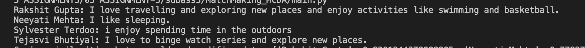
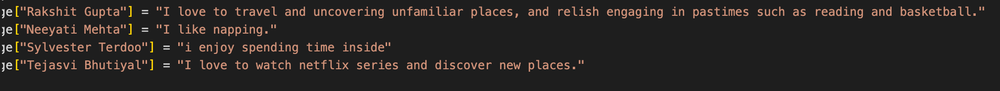
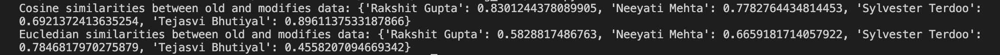

# MatchMaking_MCDA
Matching the people with similar interest with each other from MCDA class.

## What are Embeddings?

Word and sentence embeddings are a way to represent words and sentences in a computer-friendly format. They are used to capture the meaning of words and sentences so that computers can understand them better. Think of it like this: when we read a book, we understand the meaning of each word and how they relate to each other.This process of turning words and sentences into special codes or scores absed on their meaning is what we call embeddings. Therefore, word embeddings assign a score to each word based on how it relates to other words. For example, if we take the sentence “I like sleeping” and “I am too tired”, the word “sleeping” is related to “like” and “tired” is related to “am”. Word embeddings capture these relationships and assign scores to each word based on how they relate to other words. Sentence embeddings work in a similar way, but they assign scores to entire sentences instead of individual words. They are a powerful tool for making computers better at understanding human language. Here is an example of how word embeddings can be used: if we take the sentence “I like sleeping” and “I am too tired”, we can assign scores to each word based on how they relate to other words. The word “like” might have a score of 0.8 for “sleeping” and 0.2 for “tired”, while the word “am” might have a score of 0.8 for “tired” and 0.2 for “sleeping”. These scores can be used to determine the meaning of new sentences and how they relate to existing sentences.

### Data Analysis

We modified the sentences of four classmates by making both major and minor changes. For instance, in Rakshit Gupta's original sentence expressing love for travel and exploration, We altered the wording to emphasize a passion for uncovering unfamiliar places and engaging in activities like reading and basketball. Similarly, Neeyati Mehta's original sentence about liking sleeping remained unchanged, while Sylvester Terdoo's outdoor enjoyment became "spending time inside," and Tejasvi Bhutiyal's love for binge-watching series and exploring new places remained intact.

Actual Description

Modified Description

Similarity Scores

The comparison results between the old and modified data embeddings show interesting patterns. Using cosine similarity, Rakshit Gupta's and Tejasvi Bhutiyal's embeddings demonstrated high similarity (0.83 and 0.90, respectively), suggesting that the changes had a relatively small impact. Neeyati Mehta's embedding showed moderate similarity (0.78), while Sylvester Terdoo's had the lowest similarity (0.69), indicating a more noticeable impact.

Euclidean similarity measurements mirrored these trends, with Rakshit Gupta's and Tejasvi Bhutiyal's embeddings having lower negative values, signifying less impact. Conversely, Neeyati Mehta's and Sylvester Terdoo's embeddings had higher negative values, indicating more significant changes.

### Embedding Sensitivity Tests

The core of our comparison relied on Spearman’s rank correlation coefficient, which measures the similarity in the ordering of classmates from a particular person's embedding from closest to farthest, as determined by the two models. The Spearman’s rank correlation coefficient was found to be 0.81761 (81.761%), indicating a strong positive correlation between the rankings produced by the two models. This high correlation suggests that despite the change in model, the overall ordering of classmates in terms of similarity to a reference embedding (mine) remained relatively consistent.

It was observed that there were some notable shifts in rankings for certain individuals. Specifically, a few classmates who were ranked moderately far in the all-MiniLM-L6-v2 model appeared significantly closer in the all-mpnet-base-v2 model and vice versa. This shift underscores the nuanced differences in how each model processes and represents semantic similarities in text.

Below is the flattened embedding space of names clustered based on their interests using the sentence-transformers all-mpnet-base-v2 model.

## Dimension Reduction Analysis

We tried getting the visualizations at different random seeds like 12, 27 and 42 (shown on top) for sentence transformer all-MiniLM-L6-v2 model. Below are the visualizations as shown:

When using different random seed in UMAP dimension reduction exhibited notable fluctuations.This variability indicated a certain degree of instability or sensitivity in the model, suggesting that the initial embeddings' placement significantly influenced the resultant 2D projections.

However, post-tuning, UMAP with optimized parameters using optuna for n_neighbors, min_dist and metric, the model exhibited markedly reduced sensitivity to changes in the random seed. The visualizations remained more consistent across different seeds, indicating enhanced stability in the dimension reduction process by UMAP. This improvement suggests that the tuned parameters better captured the intrinsic structure of the data, making the model less reliant on the initial random configuration and more robust to variations in starting conditions.

### RESULTS:

1. Output for Tuned UMAP at ramdom seed 12

    

2. Output for Tuned UMAP at ramdom seed 27

    

3. Output for Tuned UMAP at ramdom seed 42
    
    

    Shown above are the results of optuna study to find best parameters for umap to get the best results to maximize average rank correlation between

    (a) cosine similarity in embedding space  
    (b) the Euclidean distance between points in the two-dimensional visualization

    

As we can see that after optimising UMAP with optuna, the effect of random seed was comparatively less on the visualization than without optimization. Rakshit, Nghia, Nikita and Raoof showed consistent pattern in the above plots after optimization than in the initial plots on change of random seed. It showed model preserves the meaningful relationships in the data even after reducing the dimensions. This shows that the tuned model exhibits stability however it is still not completely insensitive to random seed.